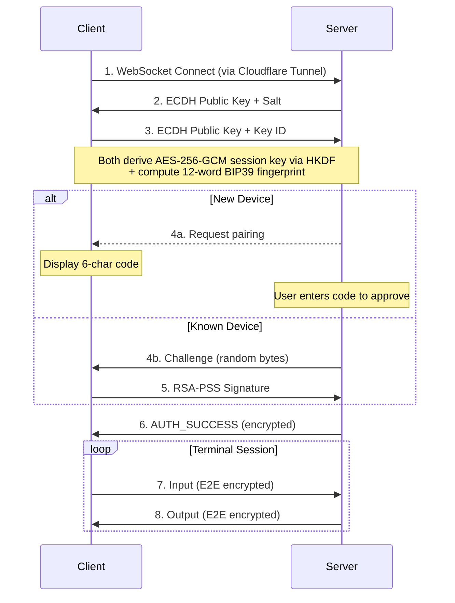

# Root_Operator

[](package.json)
[](LICENSE)
[](package.json)
[](package.json)

**Personal AI assistant for macOS - powered by latest Claude Code channels feature.**

✨ Now with built in persistent cron scheduler and identity system (inspired by Openclaw)

> ⚠️ **Security notice**
>
> Root Operator gives the connected AI agent (Claude Code) powerful capabilities on your Mac — including running shell commands, reading and writing files, installing packages, and managing scheduled jobs. By default, it runs with `--dangerously-skip-permissions`, meaning the agent can act without per-action approval.
>
> **Only run Root Operator if you understand the risks and trust the agent's configuration.** A bad prompt or misconfigured system prompt could lead to unintended or destructive changes. This is a personal tool designed for a single trusted operator — not a multi-user or shared system.
>
> Recommended baseline:
> - Review your workspace files (`SOUL.md`, `AGENTS.md`) before first run
> - Keep secrets and credentials out of the agent's reachable filesystem
> - Use device pairing and E2E encryption — never expose the tunnel without authentication
> - Monitor the agent's activity via the real-time indicators and debug logs

- 🔑 **True E2E**: ECDH key exchange → HKDF → AES-256-GCM
- 🛡️ **RSA-PSS with challenge-response** (passwordless)
- 🔐 **BIP39 fingerprinting**: 12 words on your phone, 12 on your Mac — if they match, no one is intercepting


## Why Root Operator?

| Problem | Root Operator |
|---------|---------------|
| SSH is complex to set up and expose | One-click Cloudflare Tunnel — zero open ports, zero config |
| Terminal apps lack end-to-end encryption | AES-256-GCM with ECDH key exchange on every session |
| No way to reach Claude Code from your phone | Claude Code Channel — chat with your desktop agent from anywhere |
| Scheduled tasks need cron + SSH + scripts | Built-in persistent scheduler with natural language cron jobs |
| Remote tools feel disconnected from your machine | PWA that lives on your home screen like a native app |

## Features

### Claude Code Channel

Chat with Claude Code running on your Mac — from your phone or desktop.

- **Markdown chat interface** — Rich message rendering with full Markdown + GFM support
- **Live activity indicators** — See what Claude is doing in real-time (reading files, running commands)
- **Persistent history** — File-backed JSONL message store, survives app restarts
- **MCP bridge via Claude Code channels** — Claude Code connects via stdio MCP server over Unix socket
- **Zero-config tunneling** — Cloudflare Tunnel creates a public URL instantly, no port forwarding
- **End-to-end encryption** — ECDH P-256 key exchange + AES-256-GCM for all terminal I/O
- **Visual fingerprint verification** — 12-word BIP39 mnemonic confirms secure channel on both devices
- **Device pairing** — 6-character code for new devices, challenge-response for returning ones
- **PWA client** — Install on iOS home screen, works like a native app

Under the hood, Root Operator spawns Claude Code with:

```bash
claude \
  --dangerously-skip-permissions \
  --mcp-config <root-operator-mcp.json> \
  --append-system-prompt-file <system-prompt> \
  --dangerously-load-development-channels server:root-operator
```

This gives Claude full autonomy, injects workspace identity into the system prompt, loads the MCP bridge for device communication, and connects via the Root Operator development channel.

### Identity & Workspace

Give Claude a persistent persona across sessions.

- **Workspace files** — `IDENTITY.md`, `SOUL.md`, `AGENTS.md`, `USER.md` define who Claude is and who you are
- **System prompt injection** — Workspace files automatically appended to Claude's system prompt at startup
- **First-run onboarding** — `BOOTSTRAP.md` guides initial setup, then self-deletes
- **Fully customizable** — Edit workspace files at `~/.root-operator/workspace/`

### Persistent Scheduler

Cron jobs powered by natural language, managed by Claude.

- **MCP tools** — `ro_schedule`, `ro_list_schedules`, `ro_delete_schedule`, `ro_toggle_schedule`, `ro_run_now`
- **Production-grade** — Exponential backoff, auto-disable after 10 failures, stuck-run detection
- **Persistent** — Jobs survive app restarts, stored in electron-store
- **Limits** — Up to 50 jobs, 50KB max prompt per job, 5s refire gap

## Requirements

- **macOS** 11+ (Big Sur or later) — Apple Silicon and Intel
- **Node.js** 18+ (for building from source)
- **latest Claude Code** (for Channel mode)

## Installation

### From Release

Download the latest `.dmg` from the [Releases](https://github.com/hjertefolger/Root_Operator/releases) page.

The app is signed and notarized — macOS will allow it to run without extra steps.

### From Source

```bash
git clone https://github.com/hjertefolger/Root_Operator.git
cd Root_Operator
npm install        # Installs deps + rebuilds native modules
npm run dev:app    # Start with hot reload
```

## Quick Start

1. **Launch** Root Operator — it lives in your menu bar
2. **Click "Jump"** to start the Cloudflare Tunnel
3. **Scan the QR code** or copy the tunnel URL
4. **Open on your phone** — Safari, Chrome, or add to home screen as PWA
5. **Pair** — enter the 6-character code shown on your phone into the desktop app
6. **Verify** — confirm the 12-word fingerprint matches on both devices
7. **Go** — encrypted terminal access from anywhere

To use **Claude Code Channel**, right-click the tray icon and switch to Channel mode. Messages from your phone will route to Claude Code.

## Architecture

```
┌─────────────────────────────────────────────────────────────────┐
│                        iOS / Web Client                         │
│                     PWA + xterm.js + React                      │
│              Terminal Mode  ←→  Channel Mode                    │
└──────────────────────────┬──────────────────────────────────────┘
                           │ E2E Encrypted (AES-256-GCM)
                           │
┌──────────────────────────▼──────────────────────────────────────┐
│                      Cloudflare Tunnel                          │
│                   TLS 1.3 · Zero Open Ports                     │
└──────────────────────────┬──────────────────────────────────────┘
                           │
┌──────────────────────────▼──────────────────────────────────────┐
│                    Root Operator (Electron)                      │
│                                                                  │
│  ┌─────────────┐  ┌──────────────┐  ┌────────────────────────┐  │
│  │  PTY Shell  │  │  HTTP Server │  │  Channel Manager       │  │
│  │  (node-pty) │  │  (port 22000)│  │  (Unix socket bridge)  │  │
│  └──────┬──────┘  └──────┬───────┘  └──────────┬─────────────┘  │
│         │                │                      │                │
│         │                │               ┌──────▼─────────────┐  │
│         │                │               │  Claude Code CLI   │  │
│         │                │               │  (MCP stdio)       │  │
│         │                │               └──────┬─────────────┘  │
│         │                │                      │                │
│  ┌──────▼──────┐  ┌──────▼───────┐  ┌──────────▼─────────────┐  │
│  │  Terminal   │  │   WebSocket  │  │  Scheduler · Identity  │  │
│  │  I/O        │  │   E2E Layer  │  │  Chat Store            │  │
│  └─────────────┘  └──────────────┘  └────────────────────────┘  │
└──────────────────────────────────────────────────────────────────┘
```

### Connection Flow



## Security

| Layer | Technology | Purpose |
|-------|------------|---------|
| **Transport** | Cloudflare Tunnel (TLS 1.3) | Encrypted tunnel, no open ports |
| **E2E Encryption** | AES-256-GCM + ECDH P-256 | Terminal I/O encrypted client-to-server |
| **Key Derivation** | HKDF-SHA256 | Derives session key from ECDH shared secret |
| **Authentication** | RSA-PSS 2048-bit | Proves device identity via challenge-response |
| **Fingerprint** | 12-word BIP39 mnemonic | Visual verification of secure channel |
| **Credential Storage** | macOS Keychain (keytar) | Cloudflare tokens stored in system keychain |
| **Input Sanitization** | ANSI filter | Blocks dangerous escape sequences (OSC 52, DCS, APC) |

### Security Highlights

- **Zero open ports** — Cloudflare Tunnel eliminates port forwarding entirely
- **Challenge-response on every reconnect** — cryptographic proof of key possession, not just key ID
- **Rate limiting** — 5 auth attempts per connection, 30-second challenge expiry
- **Origin validation** — WebSocket connections verified against tunnel URL
- **Session isolation** — terminal content in sessionStorage, cleared on tab close
- **IPC whitelist** — renderer process has no direct Node.js access (context isolation)
- **Hardened runtime** — macOS hardened runtime enabled for signed build

## MCP Tools

Root Operator exposes tools to Claude Code via the MCP bridge:

| Tool | Purpose |
|------|---------|
| `reply(chat_id, text)` | Send a response back to a connected device |
| `ro_schedule(name, cron, prompt, chat_id)` | Create a persistent cron job |
| `ro_list_schedules()` | List all scheduled jobs with status |
| `ro_delete_schedule(id)` | Delete a scheduled job |
| `ro_toggle_schedule(id, enabled)` | Enable or disable a job |
| `ro_run_now(id)` | Trigger a job immediately |

## Configuration

### Custom Operator URL

Set a custom URL (e.g., `yourname.rootoperator.dev`) for easy sharing:

1. Open Settings from the tray menu
2. Enter your desired subdomain
3. Your tunnel will be accessible at `yourname.rootoperator.dev`

Requires deploying the optional Cloudflare Worker — see `worker/` directory and `.env.example`.

### Environment Variables

Copy `.env.example` to `.env` for custom domain support:

| Variable | Required | Description |
|----------|----------|-------------|
| `WORKER_BASE_URL` | For custom domains | Cloudflare Worker API URL |
| `WORKER_DOMAIN` | For custom domains | Your domain for custom subdomains |
| `VITE_WORKER_DOMAIN` | For custom domains | Same as WORKER_DOMAIN (for UI) |
| `INTERNAL_PORT` | No | Local server port (default: 22000) |
| `UPDATE_REPO_OWNER` | No | GitHub owner for auto-update feed / publishing |
| `UPDATE_REPO_NAME` | No | GitHub repo for auto-update feed / publishing |
| `UPDATE_RELEASE_TYPE` | No | `release`, `prerelease`, or `draft` |
| `UPDATE_VPREFIXED_TAG_NAME` | No | Whether update tags are prefixed with `v` |
| `UPDATE_PRIVATE` | No | Use private GitHub update feed (`GH_TOKEN` required on client machines) |

### Identity Workspace

Customize Claude's persona by editing files in `~/.root-operator/workspace/`:

| File | Purpose |
|------|---------|
| `IDENTITY.md` | Who Claude is in the system |
| `SOUL.md` | Persona, tone, values, decision-making style |
| `AGENTS.md` | Agent definitions, roles, capabilities |
| `USER.md` | Your profile — name, location, preferences |
| `MEMORY.md` | Persistent memory (user-maintained) |

Files are automatically injected into Claude's system prompt at startup. Max 150KB total, 20KB per file.

## Development

```bash
npm run dev:app          # Start with hot reload (recommended)
npm run build:all        # Build client + renderer
npm run rebuild          # Rebuild native modules (node-pty, keytar)
npm run build            # Production build (signed)
npm run build:unsigned   # Production build (unsigned, local dev)
npm run release          # Publish updater-ready release metadata + artifacts
npm run security:check   # Run security audit
```

### Project Structure

```
├── main.js                  # Electron main process (server, tunnel, PTY, E2E)
├── preload.js               # IPC bridge with security whitelist
├── channel-bridge.cjs       # MCP server — bridges Electron ↔ Claude Code
├── claude-stop-hook.cjs     # Claude session cleanup hook
├── src/
│   ├── channel-manager.js   # IPC client for channel bridge (Unix socket)
│   ├── chat-store.js        # JSONL message persistence (200-msg rotation)
│   ├── scheduler.js         # Persistent cron scheduler (node-cron)
│   ├── workspace.js         # Identity workspace manager
│   ├── renderer/            # Tray app (React + Tailwind + shadcn/ui)
│   │   ├── App.jsx
│   │   └── components/      # MainView, SettingsView, PowerButton, etc.
│   └── client/              # PWA client (React + Tailwind + shadcn/ui)
│       ├── App.jsx
│       ├── components/      # Terminal, ChannelChat, PairingScreen, Header
│       └── hooks/           # useWebSocket, useAuth, useE2E, useTerminal
├── workspace-templates/     # Default identity files (seeded on first run)
├── worker/                  # Cloudflare Worker for custom subdomains (optional)
└── public/                  # Static assets, fonts, PWA manifest
```

### Native Dependencies

| Module | Purpose |
|--------|---------|
| `node-pty` | Shell/PTY spawning |
| `keytar` | macOS Keychain access |
| `cloudflared` | Cloudflare Tunnel binary |

All three are unpacked from asar for native module compatibility.

## Troubleshooting

### Native modules fail to build
```bash
npm run rebuild
```

### Tunnel won't connect
- Check internet connection
- If using a custom Operator URL, try disconnecting and reconnecting
- Enable Debug Logging in Settings, then check `~/Library/Logs/RootOperator/`

### Claude Code Channel not responding
- Ensure Claude Code is installed and available in PATH
- Check that `~/.root-operator/workspace/` exists (created on first run)
- Right-click tray icon to verify Channel mode is active

## License

[MIT](LICENSE)
