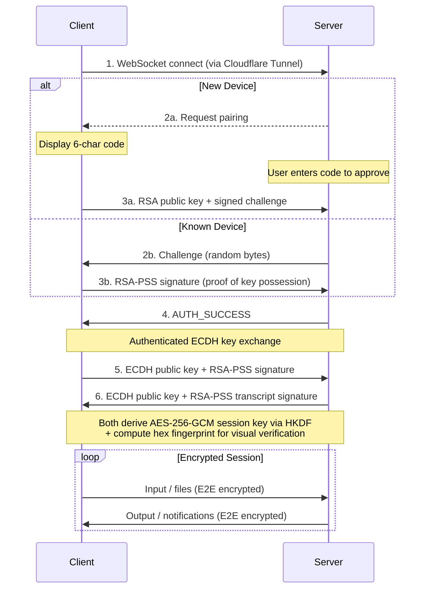

<h1 align="center">Root_Operator</h1>

<p align="center">
  <a href="package.json"></a>
  <a href="LICENSE"></a>
  <a href="package.json"></a>
  <a href="package.json"></a>
</p>

<p align="center"><strong>Your second self at the Mac. Watches your work, acts alongside you, replies wherever you are.</strong></p>

<br>

<br>
✨ Computer Use, persistent scheduler, identity, and in-harness continuity + semantic recall — all local
<br>

- 👁️ **Presence** — Shift+Shift to prompt from anywhere on the Mac; capture cursor-area or full-screen with one keystroke; annotate a region before sending
- 🖱️ **Computer Use** *(Beta)* — operate Mac apps via Accessibility + HID with semantic verification; cursor-invariant (your cursor never moves)
- 🔑 **True E2E**: ECDH key exchange → HKDF → AES-256-GCM
- 🛡️ **RSA-PSS with challenge-response**
- 🔐 **Session fingerprinting**: matching fingerprint on your phone and your Mac — if they match, no one is intercepting
- 🔁 **Bi-directional file exchange** — images, videos, and docs flow both ways with the agent for tighter building sessions
- ✏️ **In-place review** — comment on docs for iterative writing, sketch over images (mark, color, undo/redo), pull anything from your Mac straight into your phone's Files
- 🔔 **Always reachable** — native push on desktop and iOS PWA, desktop chat companion via Shift+Shift, remote restart and quit from the lock screen
- 🧠 **Continuity & recall** — selected channel history injected into every session; optional local-embedder index for deeper semantic search
<br>

## ⚠️ Security Notice

> Root Operator gives the connected AI agent (Claude Code) powerful capabilities on your Mac -- including running shell commands, reading and writing files, installing packages, and managing scheduled jobs. By default, it runs with `--dangerously-skip-permissions`, meaning the agent can act without per-action approval.
>
> **Only run Root Operator if you understand the risks and trust the agent's configuration.** This is a personal tool designed for a single trusted operator -- not a multi-user or shared system.
>
> Recommended baseline:
> - Review your workspace files (`SOUL.md`, `AGENTS.md`) periodically
> - Keep secrets and credentials out of the agent's reachable filesystem
> - Use device pairing and E2E encryption -- never expose the tunnel without authentication
> - Monitor the agent's activity via the real-time indicators and debug logs
> - Computer Use grants are per-app and in-memory only -- you approve each app the agent drives, every session

<br>

## Keyboard Shortcuts

Root Operator is built around the keyboard. Everything below works system-wide, in any app, without taking focus.

### General

| Keys | Action |
|------|--------|
| `⌘ ⇧ J` | Toggle the Cloudflare tunnel |
| `⌘ ⇧ K` | Toggle the desktop chat window |
| `⌘ ⇧ L` | Toggle Cursor Presence on/off |

The tunnel starts automatically when Root Operator launches — the shortcut is for taking it off and on without quitting the app. Auto-start can be disabled in Settings.

### Presence

| Keys | Action |
|------|--------|
| `⇧ ⇧` | Open the cursor companion at your cursor (or continue the conversation from an open reply) |
| `⌥ ⇧ ⇧` | Open the area selector — drag to pick a region, annotate (mark, color, undo/redo), then send |
| `Right-click` / `Esc` | Dismiss the companion or reply (half-written prompts persist) |

### Sending & Writing

| Keys | Action |
|------|--------|
| `↵` | Send the prompt (text only) |
| `⌥ ↵` | Send with an 800×800 capture centered on your cursor |
| `⌥ ⇧ ↵` | Send with a full-screen capture |
| `⇧ ↵` | Newline in the prompt |

## Features

### Presence

A cursor-anchored prompt surface that lives everywhere on the Mac. Tap Shift twice and a small input appears at your cursor — type, send, get a reply right where you're looking. Optional captures attach automatically.

The companion is a non-stealing NSPanel — it doesn't take focus from the app you're working in. Replies stack near the bubble; half-written prompts persist across dismissals.

See [Keyboard Shortcuts](#keyboard-shortcuts) for the full surface.

### Computer Use *(Beta)*

The agent operates your Mac alongside you — not for you. It reads the screen via Accessibility (AX), drives controls via AX writes and synthesized HID, and verifies outcomes semantically (e.g. confirms the font size actually changed on the selection, not just that a combobox accepted a value).

- **Cursor-invariant** -- the agent never visibly borrows your cursor. HID synthesis saves and restores your pointer with sub-frame precision; if it can't, it fails closed
- **Atomic chains** -- `agent_act` runs multi-step workflows (focus → select → write → verify) as one unit, holding focus across steps that fragmented per-tool calls would lose
- **Op registry** -- `agent_describe_ops` documents known native patterns (e.g. font-size combo boxes, NSComboBox commit, geometry attribute shapes) so chains compose against verified primitives
- **Per-app permission** -- every app the agent drives prompts for explicit consent on first use; grants live in-memory only and reset each session
- **Read primitives** -- focused element, subtree, window, cursor neighborhood; for situational awareness without disturbing focus
- **Drive primitives** -- click, hover, drag, type, keystroke (app-scoped + global), key hold, modifier latch, scroll, menu commands, named-key press, selection by range/substring

Built on a native `ax-helper` (separate process, hardened entitlements) plus an Electron-side action registry. AX-first by default, HID as fallback with explicit guards. Beta: coverage of native controls expanding; report patterns that don't compose cleanly.

### Claude Code Channel

Chat with Claude Code running on your Mac -- from any paired device.

- **Markdown chat** -- rich rendering with full GFM support
- **Bi-directional attachments** -- images, video, and docs flow between Mac and phone with a full-bleed viewer (pinch-zoom, fullscreen video, native iOS share-sheet on download); doc viewer supports inline comments that batch-send back as a structured message
- **Push notifications** -- background notifications via Web Push (VAPID), respects foreground suppression
- **Live activity indicators** -- see what Claude is doing in real-time (reading files, running commands)
- **Persistent history** -- file-backed JSONL message store, survives app restarts
- **Multi-device** -- pair your phone, tablet, or any browser; messages sync across all connected clients

### Security

End-to-end encrypted with mutual authentication. No trust-on-first-use -- every session is cryptographically verified.

| Layer | Technology | Purpose |
|-------|------------|---------|
| **Transport** | Cloudflare Tunnel (TLS 1.3) | Encrypted tunnel, zero open ports |
| **E2E encryption** | AES-256-GCM + ECDH P-256 | All traffic encrypted client-to-server |
| **Key derivation** | HKDF-SHA256 | Session key derived from ECDH shared secret |
| **Authentication** | RSA-PSS 2048-bit | Mutual identity proof via challenge-response |
| **MITM protection** | Transcript-bound signatures | Both sides sign ECDH keys with paired RSA identity; spliced halves are rejected |
| **Fingerprint** | Hex fingerprint (4-block) | Visual verification of secure channel on both devices |
| **Credential storage** | macOS Keychain (keytar) + Electron safeStorage | Private keys and tokens never stored in plaintext |
| **Network isolation** | Loopback-only binding | Bridge server bound to 127.0.0.1, unreachable from LAN |
| **Rate limiting** | Per-source (CF-Connecting-IP) | Connection and pairing limits scoped to individual clients |
| **Session revocation** | Immediate socket eviction | Removing a device terminates all its active connections instantly |
| **Input sanitization** | ANSI filter | Blocks dangerous escape sequences (OSC 52, DCS, APC) |

The Security Panel is accessible from both the web client (lock icon) and the desktop tray, showing cipher suite, device identity, session fingerprint, and connection status.

### Persistent Scheduler

Cron jobs powered by natural language, managed by Claude.

- **MCP tools** -- `ro_schedule`, `ro_list_schedules`, `ro_delete_schedule`, `ro_toggle_schedule`, `ro_run_now`
- **Production-grade** -- exponential backoff, auto-disable after 10 failures, stuck-run detection
- **Persistent** -- jobs survive app restarts, stored in electron-store
- **Limits** -- up to 50 jobs, 50KB max prompt per job, 5s refire gap

### Identity & Workspace

Give Claude a persistent persona across sessions.

- **Workspace files** -- `IDENTITY.md`, `SOUL.md`, `AGENTS.md`, `USER.md` define who Claude is and who you are
- **System prompt injection** -- workspace files automatically appended to Claude's system prompt at startup
- **First-run onboarding** -- `BOOTSTRAP.md` guides initial setup, then self-deletes
- **Fully customizable** -- edit workspace files at `~/.root-operator/workspace/`

### Continuity & Recall

Two complementary layers give Claude memory without a cloud round-trip.

**Channel history** — a selected rolling tail of your conversation (~200 messages) is written into the appended system prompt on every session, wrapped in a `<conversation-history>` envelope. Claude wakes up already inside the thread. No retrieval step, no relevance guessing — just the context you already produced together.

**Dynamic indexing + recall tools** — an optional local semantic index over the full conversation archive. When indexing is on, each turn is chunked, embedded with `nomic-embed-text-v1.5` (768d, bundled), and stored in SQLite (FTS5 + `vec0`). Claude calls `ro_memory_{search,save,update,delete}` as MCP tools when it needs to recall something older than the tail — explicit, not ambient.

- **Local-first** -- everything runs on-device
- **Hybrid retrieval** -- BM25 keyword + vector cosine with reciprocal rank fusion
- **Opt-in indexing** -- disabled by default; toggle in Settings → Dynamic Indexing
- **Tools always available** -- save/search/update/delete work regardless of toggle; the toggle only gates passive capture
- **Resilient** -- pre-open integrity validation, rolling backups, WAL checkpoint before snapshot
- **Paths** -- database at `~/.root-operator/workspace/brain/memory.db`, history at `channel-history.jsonl` (bounded to 200 messages)

## Requirements

- **macOS** 11+ (Big Sur or later) -- **Apple Silicon (M1 or newer)**. Intel Macs are not supported as of v2.4.5.
- **Claude Code** (latest, with channels support)

## Installation

Download the latest `.dmg` from the [Releases](https://github.com/hjertefolger/Root_Operator/releases) page.

The app is signed and notarized -- macOS will allow it to run without extra steps.

## Quick Start

1. **Launch** Root Operator -- it lives in your menu bar
2. **Grant macOS permissions** -- Accessibility and Screen Recording (System Settings → Privacy & Security). Required for Computer Use; the app will prompt on first use
3. **Start the tunnel** -- click the power button to create a Cloudflare Tunnel
4. **Open the tunnel URL** on your phone (copy from the desktop app)
5. **Pair** -- enter the 6-character code shown on your phone into the desktop app
6. **Verify** -- confirm the hex fingerprint matches on both devices
7. **Go** -- encrypted chat with Claude from anywhere

## Architecture

```
+-----------------------------------------------------------------+
|                      iOS / Web Client (PWA)                      |
|                  React + Tailwind + shadcn/ui                    |
|         Channel Chat  -  File Attachments  -  Notifications      |
+-------------------------------+---------------------------------+
                                | E2E Encrypted (AES-256-GCM)
                                | Authenticated ECDH + RSA-PSS
                                |
+-------------------------------+---------------------------------+
|                       Cloudflare Tunnel                          |
|                    TLS 1.3 - Zero Open Ports                     |
+-------------------------------+---------------------------------+
                                |
+-------------------------------+---------------------------------+
|                  Root Operator (Electron, macOS)                  |
|                                                                  |
|  +---------------+  +----------------+  +---------------------+  |
|  |  HTTP Server  |  |  WebSocket     |  |  Channel Manager    |  |
|  |  (127.0.0.1)  |  |  E2E Layer     |  |  (Unix socket MCP)  |  |
|  +-------+-------+  +-------+--------+  +----------+----------+  |
|          |                  |                       |             |
|          |                  |              +--------+----------+  |
|          |                  |              |  Claude Code CLI  |  |
|          |                  |              |  (channels mode)  |  |
|          |                  |              +--------+----------+  |
|          |                  |                       |             |
|  +-------+-------+  +------+--------+  +-----------+----------+  |
|  |  Static       |  |  Device Auth  |  |  Scheduler - Chat    |  |
|  |  Assets       |  |  + Pairing    |  |  Store - Identity    |  |
|  +---------------+  +---------------+  +----------------------+  |
|                                                                  |
|  +------------------------------------------------------------+  |
|  |  Memory — Channel History (JSONL) + SQLite + Embedder      |  |
|  +------------------------------------------------------------+  |
+-----------------------------------------------------------------+
```

### Connection Flow



## MCP Tools

Root Operator exposes tools to Claude Code via the MCP bridge.

### Channel & Scheduling

| Tool | Purpose |
|------|---------|
| `reply(chat_id, text, attachments?)` | Send a response back, optionally with image, video (mp4/mov/webm up to 25 MB), or doc (.md/.txt up to 1 MB) attachments |
| `ro_schedule(name, cron, prompt, chat_id)` | Create a persistent cron job |
| `ro_list_schedules()` | List all scheduled jobs with status |
| `ro_delete_schedule(id)` | Delete a scheduled job |
| `ro_toggle_schedule(id, enabled)` | Enable or disable a job |
| `ro_run_now(id)` | Trigger a job immediately |

### Memory

| Tool | Purpose |
|------|---------|
| `ro_memory_search(query, limit?, chat_id?)` | Recall memories older than the session's channel-history tail |
| `ro_memory_save(content, chat_id?)` | Save content to memory (bypasses the indexing toggle) |
| `ro_memory_update(id, content)` | Update a stored memory by id |
| `ro_memory_delete(id)` | Delete a stored memory by id |

### Computer Use

Discovery and atomic execution:

| Tool | Purpose |
|------|---------|
| `agent_describe_ops(...)` | Documented patterns and primitive specs — call this before composing chains for native controls |
| `agent_act(steps)` | Atomic multi-step chain (focus → select → write → verify) holding focus across steps |
| `agent_run_chain(...)` | Lower-level chain runner |
| `agent_list_app_workflows`, `agent_remember_app_workflow` | Per-app workflow library |
| `agent_check_ax`, `agent_discover_app` | Pre-flight + capability checks |

Read:

| Tool | Purpose |
|------|---------|
| `agent_read_focused`, `agent_read_subtree`, `agent_read_window`, `agent_read_at_cursor` | AX reads at varying scope, non-disruptive |
| `agent_find_element`, `agent_recent_events` | Locate elements, inspect recent activity |

Drive:

| Tool | Purpose |
|------|---------|
| `agent_click_at`, `agent_press_at`, `agent_hover_at`, `agent_drag`, `agent_scroll_at` | HID with cursor save/restore |
| `agent_focus_at`, `agent_focus_element`, `agent_park`, `agent_move_to`, `agent_move_to_cursor` | Focus and pointer management |
| `agent_type_text`, `agent_keystroke`, `agent_keystroke_global`, `agent_press_named`, `agent_key_hold`, `agent_modifier_latch` | Text and key input |
| `agent_select_all`, `agent_select_range`, `agent_select_substring`, `agent_write_selection` | Selection and structured writes |
| `agent_menu_command` | Drive native menus by path |

## Configuration

### Custom Operator URL

Set a custom URL (e.g., `yourname.rootoperator.dev`) for easy access:

1. Open Settings from the tray menu
2. Enter your desired subdomain
3. Your tunnel will be accessible at `yourname.rootoperator.dev`

### Environment Variables

Copy `.env.example` to `.env` for custom domain support:

| Variable | Required | Description |
|----------|----------|-------------|
| `WORKER_BASE_URL` | For custom domains | Cloudflare Worker API URL |
| `WORKER_DOMAIN` | For custom domains | Your domain for custom subdomains |
| `VITE_WORKER_DOMAIN` | For custom domains | Same as WORKER_DOMAIN (for UI) |
| `INTERNAL_PORT` | No | Local server port (default: 22000) |
| `UPDATE_REPO_OWNER` | No | GitHub owner for auto-update feed / publishing |
| `UPDATE_REPO_NAME` | No | GitHub repo for auto-update feed / publishing |
| `UPDATE_RELEASE_TYPE` | No | `release`, `prerelease`, or `draft` |
| `UPDATE_VPREFIXED_TAG_NAME` | No | Whether update tags are prefixed with `v` |
| `UPDATE_PRIVATE` | No | Use private GitHub update feed (`GH_TOKEN` required on client machines) |

### Identity Workspace

Customize Claude's persona by editing files in `~/.root-operator/workspace/`:

| File | Purpose |
|------|---------|
| `IDENTITY.md` | Who Claude is -- name, creature, vibe, emoji |
| `SOUL.md` | Persona, tone, values, boundaries |
| `AGENTS.md` | Agent behavior, safety rules, collaboration patterns |
| `USER.md` | Your profile -- name, timezone, preferences |
| `MEMORY.md` | Index of long-term memories — curated by Claude, surfaced at session start |

Files are automatically injected into Claude's system prompt at startup. Max 150KB total, 20KB per file.

## Development

```bash
npm run dev:app          # Start with hot reload (recommended)
npm run build:all        # Build client + renderer
npm run rebuild          # Rebuild native modules (node-pty, keytar)
npm run build            # Production build (signed + notarized)
npm run build:unsigned   # Production build (unsigned, local dev)
npm run release          # Publish updater-ready release metadata + artifacts
npm run security:check   # Run security audit
```

### Project Structure

```
main.js                  # Electron main process (server, tunnel, E2E, auth)
preload.js               # IPC bridge with security whitelist
channel-bridge.cjs       # MCP server -- bridges Electron <-> Claude Code
claude-stop-hook.cjs     # Claude session cleanup hook
src/
  main/
    agent-actions.js     # Computer Use action registry (op specs + dispatch)
    agent-avatar.js      # Presence dot + halo state
    agent-halo.js        # Detach/return motion
    claude-lifecycle.js  # Claude Code subprocess management
  shared/                # Shared config (presence motion, etc.)
  channel-manager.js     # IPC client for channel bridge (Unix socket)
  chat-store.js          # JSONL message persistence (200-msg rotation)
  scheduler.js           # Persistent cron scheduler (node-cron)
  workspace.js           # Identity workspace manager
  renderer/              # Desktop tray app (React + Tailwind + shadcn/ui)
    components/          # MainView, SettingsView, SecurityPanel, PowerButton
  client/                # PWA client (React + Tailwind + shadcn/ui)
    components/          # ChannelChat, SecurityPanel, PairingScreen, Header
    hooks/               # useWebSocket, useAuth, useE2E, useNotifications, useFileAttachment
build/native/ax-helper   # Native AX/HID helper (separate process, hardened)
public/                  # Static assets, fonts, PWA manifest, service worker
workspace-templates/     # Default identity files (seeded on first run)
worker/                  # Cloudflare Worker for custom subdomains (optional)
```

### Native Dependencies

| Module | Purpose |
|--------|---------|
| `node-pty` | Shell/PTY spawning |
| `keytar` | macOS Keychain access |
| `cloudflared` | Cloudflare Tunnel binary |
| `better-sqlite3` | Synchronous SQLite for Dynamic Memory store (FTS5 + `vec0`) |
| `onnxruntime-node` | Local embedder runtime (`nomic-embed-text-v1.5`, 768d) |
| `uiohook-napi` | Global keyboard shortcut listener |

All native modules are unpacked from asar for native module compatibility and rebuilt per architecture during the production build.

## Troubleshooting

### Native modules fail to build
```bash
npm run rebuild
```

### Tunnel won't connect
- Check internet connection
- If using a custom Operator URL, try disconnecting and reconnecting
- Enable Debug Logging in Settings, then check `~/Library/Logs/RootOperator/`

### Claude Code Channel not responding
- Ensure Claude Code is installed and available in PATH
- Check that `~/.root-operator/workspace/` exists (created on first run)
- Right-click tray icon to verify Channel mode is active

### Status dot stays orange after launch ("Claude session not started")
Root Operator runs Claude with `--dangerously-skip-permissions`. The first time you use that flag, Claude shows a one-time TUI acknowledgement that must be accepted interactively — Root Operator can't accept it for you, so the session hangs and the status dot stays orange.

Fix:
1. Quit Root Operator
2. In a terminal, run: `claude --dangerously-skip-permissions`
3. Accept the acknowledgement at the prompt
4. Quit the terminal session (the acceptance is persisted)
5. Relaunch Root Operator — the status dot should turn green

### Push notifications not arriving
- Ensure notifications are enabled in the web client (bell icon)
- Background the app -- notifications are suppressed when the app is in the foreground
- On iOS PWA, swipe the app fully out of the app switcher and reopen to force service worker refresh

## License

[MIT](LICENSE)
