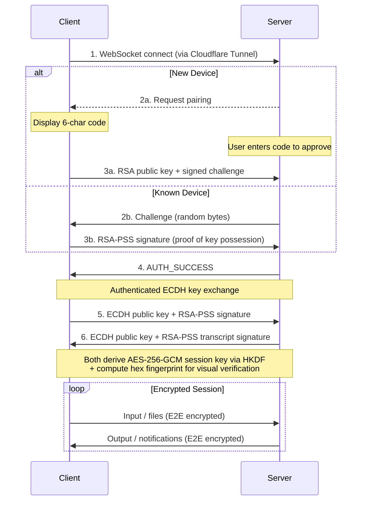

<h1 align="center">Root_Operator</h1>

<p align="center">
  <a href="package.json"></a>
  <a href="LICENSE"></a>
  <a href="package.json"></a>
  <a href="package.json"></a>
</p>

<p align="center"><strong>Personal AI assistant for macOS powered by Claude Code channels.</strong></p>

<br>

<br>
✨ Persistent cron scheduler, identity system, and in-harness continuity + semantic recall — all local
<br>

- 🔑 **True E2E**: ECDH key exchange → HKDF → AES-256-GCM
- 🛡️ **RSA-PSS with challenge-response**
- 🔐 **Session fingerprinting**: matching fingerprint on your phone and your Mac — if they match, no one is intercepting
- 🧠 **Continuity & recall** — selected channel history injected into every session; optional local-embedder index for deeper semantic search
<br>

> **Security notice**
>
> Root Operator gives the connected AI agent (Claude Code) powerful capabilities on your Mac -- including running shell commands, reading and writing files, installing packages, and managing scheduled jobs. By default, it runs with `--dangerously-skip-permissions`, meaning the agent can act without per-action approval.
>
> **Only run Root Operator if you understand the risks and trust the agent's configuration.** This is a personal tool designed for a single trusted operator -- not a multi-user or shared system.
>
> Recommended baseline:
> - Review your workspace files (`SOUL.md`, `AGENTS.md`) periodically
> - Keep secrets and credentials out of the agent's reachable filesystem
> - Use device pairing and E2E encryption -- never expose the tunnel without authentication
> - Monitor the agent's activity via the real-time indicators and debug logs

<br>

## Why Root Operator?

| Problem | Root Operator |
|---------|---------------|
| SSH is complex to set up and expose | One-click Cloudflare Tunnel -- zero open ports, zero config |
| Terminal apps lack end-to-end encryption | Authenticated ECDH + AES-256-GCM with mutual identity verification |
| No way to reach Claude Code from your phone | Claude Code channels -- chat with your desktop agent from anywhere |
| Scheduled tasks need cron + SSH + scripts | Built-in persistent scheduler with natural language cron jobs |
| Remote tools feel disconnected from your machine | PWA that lives on your home screen like a native app |

## Features

### Claude Code Channel

Chat with Claude Code running on your Mac -- from any paired device.

- **Markdown chat** -- rich rendering with full GFM support
- **File attachments** -- send images and files between devices, rendered as pills in the chat
- **Push notifications** -- background notifications via Web Push (VAPID), respects foreground suppression
- **Live activity indicators** -- see what Claude is doing in real-time (reading files, running commands)
- **Persistent history** -- file-backed JSONL message store, survives app restarts
- **Multi-device** -- pair your phone, tablet, or any browser; messages sync across all connected clients

### Security

End-to-end encrypted with mutual authentication. No trust-on-first-use -- every session is cryptographically verified.

| Layer | Technology | Purpose |
|-------|------------|---------|
| **Transport** | Cloudflare Tunnel (TLS 1.3) | Encrypted tunnel, zero open ports |
| **E2E encryption** | AES-256-GCM + ECDH P-256 | All traffic encrypted client-to-server |
| **Key derivation** | HKDF-SHA256 | Session key derived from ECDH shared secret |
| **Authentication** | RSA-PSS 2048-bit | Mutual identity proof via challenge-response |
| **MITM protection** | Transcript-bound signatures | Both sides sign ECDH keys with paired RSA identity; spliced halves are rejected |
| **Fingerprint** | Hex fingerprint (4-block) | Visual verification of secure channel on both devices |
| **Credential storage** | macOS Keychain (keytar) + Electron safeStorage | Private keys and tokens never stored in plaintext |
| **Network isolation** | Loopback-only binding | Bridge server bound to 127.0.0.1, unreachable from LAN |
| **Rate limiting** | Per-source (CF-Connecting-IP) | Connection and pairing limits scoped to individual clients |
| **Session revocation** | Immediate socket eviction | Removing a device terminates all its active connections instantly |
| **Input sanitization** | ANSI filter | Blocks dangerous escape sequences (OSC 52, DCS, APC) |

The Security Panel is accessible from both the web client (lock icon) and the desktop tray, showing cipher suite, device identity, session fingerprint, and connection status.

### Persistent Scheduler

Cron jobs powered by natural language, managed by Claude.

- **MCP tools** -- `ro_schedule`, `ro_list_schedules`, `ro_delete_schedule`, `ro_toggle_schedule`, `ro_run_now`
- **Production-grade** -- exponential backoff, auto-disable after 10 failures, stuck-run detection
- **Persistent** -- jobs survive app restarts, stored in electron-store
- **Limits** -- up to 50 jobs, 50KB max prompt per job, 5s refire gap

### Identity & Workspace

Give Claude a persistent persona across sessions.

- **Workspace files** -- `IDENTITY.md`, `SOUL.md`, `AGENTS.md`, `USER.md` define who Claude is and who you are
- **System prompt injection** -- workspace files automatically appended to Claude's system prompt at startup
- **First-run onboarding** -- `BOOTSTRAP.md` guides initial setup, then self-deletes
- **Fully customizable** -- edit workspace files at `~/.root-operator/workspace/`

### Continuity & Recall

Two complementary layers give Claude memory without a cloud round-trip.

**Channel history** — a selected rolling tail of your conversation (~200 messages) is written into the appended system prompt on every session, wrapped in a `<conversation-history>` envelope. Claude wakes up already inside the thread. No retrieval step, no relevance guessing — just the context you already produced together.

**Dynamic indexing + recall tools** — an optional local semantic index over the full conversation archive. When indexing is on, each turn is chunked, embedded with `nomic-embed-text-v1.5` (768d, bundled), and stored in SQLite (FTS5 + `vec0`). Claude calls `ro_memory_{search,save,update,delete}` as MCP tools when it needs to recall something older than the tail — explicit, not ambient.

- **Local-first** -- everything runs on-device
- **Hybrid retrieval** -- BM25 keyword + vector cosine with reciprocal rank fusion
- **Opt-in indexing** -- disabled by default; toggle in Settings → Dynamic Indexing
- **Tools always available** -- save/search/update/delete work regardless of toggle; the toggle only gates passive capture
- **Resilient** -- pre-open integrity validation, rolling backups, WAL checkpoint before snapshot
- **Paths** -- database at `~/.root-operator/workspace/brain/memory.db`, history at `channel-history.jsonl` (bounded to 200 messages)

## Requirements

- **macOS** 11+ (Big Sur or later) -- Apple Silicon and Intel
- **Claude Code** (latest, with channels support)

## Installation

Download the latest `.dmg` from the [Releases](https://github.com/hjertefolger/Root_Operator/releases) page.

The app is signed and notarized -- macOS will allow it to run without extra steps.

## Quick Start

1. **Launch** Root Operator -- it lives in your menu bar
2. **Start the tunnel** -- click the power button to create a Cloudflare Tunnel
3. **Open the tunnel URL** on your phone (copy from the desktop app)
4. **Pair** -- enter the 6-character code shown on your phone into the desktop app
5. **Verify** -- confirm the hex fingerprint matches on both devices
6. **Go** -- encrypted chat with Claude from anywhere

## Architecture

```
+-----------------------------------------------------------------+
|                      iOS / Web Client (PWA)                      |
|                  React + Tailwind + shadcn/ui                    |
|         Channel Chat  -  File Attachments  -  Notifications      |
+-------------------------------+---------------------------------+
                                | E2E Encrypted (AES-256-GCM)
                                | Authenticated ECDH + RSA-PSS
                                |
+-------------------------------+---------------------------------+
|                       Cloudflare Tunnel                          |
|                    TLS 1.3 - Zero Open Ports                     |
+-------------------------------+---------------------------------+
                                |
+-------------------------------+---------------------------------+
|                  Root Operator (Electron, macOS)                  |
|                                                                  |
|  +---------------+  +----------------+  +---------------------+  |
|  |  HTTP Server  |  |  WebSocket     |  |  Channel Manager    |  |
|  |  (127.0.0.1)  |  |  E2E Layer     |  |  (Unix socket MCP)  |  |
|  +-------+-------+  +-------+--------+  +----------+----------+  |
|          |                  |                       |             |
|          |                  |              +--------+----------+  |
|          |                  |              |  Claude Code CLI  |  |
|          |                  |              |  (channels mode)  |  |
|          |                  |              +--------+----------+  |
|          |                  |                       |             |
|  +-------+-------+  +------+--------+  +-----------+----------+  |
|  |  Static       |  |  Device Auth  |  |  Scheduler - Chat    |  |
|  |  Assets       |  |  + Pairing    |  |  Store - Identity    |  |
|  +---------------+  +---------------+  +----------------------+  |
|                                                                  |
|  +------------------------------------------------------------+  |
|  |  Memory — Channel History (JSONL) + SQLite + Embedder      |  |
|  +------------------------------------------------------------+  |
+-----------------------------------------------------------------+
```

### Connection Flow



## MCP Tools

Root Operator exposes tools to Claude Code via the MCP bridge:

| Tool | Purpose |
|------|---------|
| `reply(chat_id, text, attachments?)` | Send a response — and optionally image attachments — back to a connected device |
| `ro_schedule(name, cron, prompt, chat_id)` | Create a persistent cron job |
| `ro_list_schedules()` | List all scheduled jobs with status |
| `ro_delete_schedule(id)` | Delete a scheduled job |
| `ro_toggle_schedule(id, enabled)` | Enable or disable a job |
| `ro_run_now(id)` | Trigger a job immediately |
| `ro_memory_search(query, limit?, chat_id?)` | Recall memories older than the session's channel-history tail |
| `ro_memory_save(content, chat_id?)` | Save content to memory (bypasses the indexing toggle) |
| `ro_memory_update(id, content)` | Update a stored memory by id |
| `ro_memory_delete(id)` | Delete a stored memory by id |

## Configuration

### Custom Operator URL

Set a custom URL (e.g., `yourname.rootoperator.dev`) for easy access:

1. Open Settings from the tray menu
2. Enter your desired subdomain
3. Your tunnel will be accessible at `yourname.rootoperator.dev`

### Environment Variables

Copy `.env.example` to `.env` for custom domain support:

| Variable | Required | Description |
|----------|----------|-------------|
| `WORKER_BASE_URL` | For custom domains | Cloudflare Worker API URL |
| `WORKER_DOMAIN` | For custom domains | Your domain for custom subdomains |
| `VITE_WORKER_DOMAIN` | For custom domains | Same as WORKER_DOMAIN (for UI) |
| `INTERNAL_PORT` | No | Local server port (default: 22000) |
| `UPDATE_REPO_OWNER` | No | GitHub owner for auto-update feed / publishing |
| `UPDATE_REPO_NAME` | No | GitHub repo for auto-update feed / publishing |
| `UPDATE_RELEASE_TYPE` | No | `release`, `prerelease`, or `draft` |
| `UPDATE_VPREFIXED_TAG_NAME` | No | Whether update tags are prefixed with `v` |
| `UPDATE_PRIVATE` | No | Use private GitHub update feed (`GH_TOKEN` required on client machines) |

### Identity Workspace

Customize Claude's persona by editing files in `~/.root-operator/workspace/`:

| File | Purpose |
|------|---------|
| `IDENTITY.md` | Who Claude is -- name, creature, vibe, emoji |
| `SOUL.md` | Persona, tone, values, boundaries |
| `AGENTS.md` | Agent behavior, safety rules, collaboration patterns |
| `USER.md` | Your profile -- name, timezone, preferences |
| `MEMORY.md` | Index of long-term memories — curated by Claude, surfaced at session start |

Files are automatically injected into Claude's system prompt at startup. Max 150KB total, 20KB per file.

## Development

```bash
npm run dev:app          # Start with hot reload (recommended)
npm run build:all        # Build client + renderer
npm run rebuild          # Rebuild native modules (node-pty, keytar)
npm run build            # Production build (signed + notarized)
npm run build:unsigned   # Production build (unsigned, local dev)
npm run release          # Publish updater-ready release metadata + artifacts
npm run security:check   # Run security audit
```

### Project Structure

```
main.js                  # Electron main process (server, tunnel, E2E, auth)
preload.js               # IPC bridge with security whitelist
channel-bridge.cjs       # MCP server -- bridges Electron <-> Claude Code
claude-stop-hook.cjs     # Claude session cleanup hook
src/
  channel-manager.js     # IPC client for channel bridge (Unix socket)
  chat-store.js          # JSONL message persistence (200-msg rotation)
  scheduler.js           # Persistent cron scheduler (node-cron)
  workspace.js           # Identity workspace manager
  renderer/              # Desktop tray app (React + Tailwind + shadcn/ui)
    components/          # MainView, SettingsView, SecurityPanel, PowerButton
  client/                # PWA client (React + Tailwind + shadcn/ui)
    components/          # ChannelChat, SecurityPanel, PairingScreen, Header
    hooks/               # useWebSocket, useAuth, useE2E, useNotifications, useFileAttachment
public/                  # Static assets, fonts, PWA manifest, service worker
workspace-templates/     # Default identity files (seeded on first run)
worker/                  # Cloudflare Worker for custom subdomains (optional)
```

### Native Dependencies

| Module | Purpose |
|--------|---------|
| `node-pty` | Shell/PTY spawning |
| `keytar` | macOS Keychain access |
| `cloudflared` | Cloudflare Tunnel binary |
| `better-sqlite3` | Synchronous SQLite for Dynamic Memory store (FTS5 + `vec0`) |
| `onnxruntime-node` | Local embedder runtime (`nomic-embed-text-v1.5`, 768d) |
| `uiohook-napi` | Global keyboard shortcut listener |

All native modules are unpacked from asar for native module compatibility and rebuilt per architecture during the production build.

## Troubleshooting

### Native modules fail to build
```bash
npm run rebuild
```

### Tunnel won't connect
- Check internet connection
- If using a custom Operator URL, try disconnecting and reconnecting
- Enable Debug Logging in Settings, then check `~/Library/Logs/RootOperator/`

### Claude Code Channel not responding
- Ensure Claude Code is installed and available in PATH
- Check that `~/.root-operator/workspace/` exists (created on first run)
- Right-click tray icon to verify Channel mode is active

### Push notifications not arriving
- Ensure notifications are enabled in the web client (bell icon)
- Background the app -- notifications are suppressed when the app is in the foreground
- On iOS PWA, swipe the app fully out of the app switcher and reopen to force service worker refresh

## License

[MIT](LICENSE)
